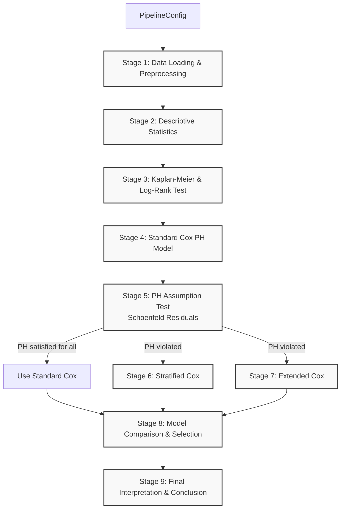

# Survival Analysis: Primary Biliary Cirrhosis (PBC)

> **Cox Proportional Hazard Model with PH Assumption Violation Handling**


---

## Table of Contents

- [Overview](#overview)
- [Research Objective](#research-objective)
- [Dataset](#dataset)
- [Methodology](#methodology)
- [Pipeline Structure](#pipeline-structure)
- [Key Findings and Insights](#key-findings-and-insights)
- [Model Comparison](#model-comparison)
- [Final Model Interpretation](#final-model-interpretation)
- [Conclusion](#conclusion)
- [Requirements](#requirements)
- [Usage](#usage)
- [References](#references)

---

## Overview

This project implements an end-to-end survival analysis pipeline for the Mayo Clinic Primary Biliary Cirrhosis (PBC) dataset. The analysis uses the Cox Proportional Hazard Model to identify prognostic factors influencing patient survival. Three model variants are explored: Standard Cox, Stratified Cox, and Extended Cox (time-varying coefficient), with a systematic approach to detecting and handling violations of the proportional hazard (PH) assumption.

---

## Research Objective

To identify prognostic factors that significantly affect the survival of PBC patients using the Cox Proportional Hazard Model, including rigorous assumption testing and appropriate remediation when assumptions are violated.

---

## Dataset

**Source**: Mayo Clinic Primary Biliary Cirrhosis Data

| Attribute       | Value                                          |
| --------------- | ---------------------------------------------- |
| Total patients  | 418 (raw), 412 (after cleaning)                |
| Rows dropped    | 6 (missing values on `stage`, 1.4% of total) |
| Events (deaths) | 157                                            |
| Censored        | 255                                            |
| Event rate      | 38.1%                                          |
| Follow-up range | 41 -- 4795 days                                |

### Preprocessing Decisions

- The `status` column is encoded as: 0 = censored, 1 = transplant (treated as censored), 2 = dead (event). A binary `event` column is derived where `event = 1` if `status == 2`, else `event = 0`.
- `age` is already expressed in years; no conversion is needed.
- `stage` (ordinal, 1--4) is treated as continuous for parsimony (1 coefficient instead of 3 dummies), assuming log-linearity of hazard with respect to stage.
- Missing values: only 6 records on `stage` out of 418 (1.4%). These are dropped under the assumption of Missing Completely At Random (MCAR).

### Covariates Used

| Variable    | Description                                 |
| ----------- | ------------------------------------------- |
| `age`     | Patient age in years                        |
| `bili`    | Serum bilirubin (mg/dL)                     |
| `albumin` | Serum albumin (g/dL)                        |
| `stage`   | Histologic stage of disease (1--4, ordinal) |

### Descriptive Statistics

**Continuous Variables:**

| Variable | Count | Mean    | Std     | Min   | 25%     | 50%     | 75%     | Max     |
| -------- | ----- | ------- | ------- | ----- | ------- | ------- | ------- | ------- |
| time     | 412   | 1916.84 | 1099.94 | 41.00 | 1094.25 | 1713.50 | 2610.50 | 4795.00 |
| age      | 412   | 50.65   | 10.47   | 26.28 | 42.74   | 51.00   | 58.04   | 78.44   |
| bili     | 412   | 3.23    | 4.43    | 0.30  | 0.80    | 1.40    | 3.40    | 28.00   |
| albumin  | 412   | 3.50    | 0.42    | 1.96  | 3.25    | 3.53    | 3.78    | 4.64    |

**Stage Distribution:**

| Stage   | N   | Percent |
| ------- | --- | ------- |
| Stage 1 | 21  | 5.1%    |
| Stage 2 | 92  | 22.3%   |
| Stage 3 | 155 | 37.6%   |
| Stage 4 | 144 | 35.0%   |

**Median by Outcome Group:**

| Variable | Censored | Event |
| -------- | -------- | ----- |
| age      | 48.76    | 53.31 |
| bili     | 1.00     | 3.20  |
| albumin  | 3.60     | 3.40  |
| stage    | 3.00     | 4.00  |

---

## Methodology

1. **Configuration** -- All research parameters are consolidated in a single `PipelineConfig` dataclass for consistency and reproducibility.
2. **Data Loading and Preprocessing** -- Load dataset, handle missing values, encode event variable.
3. **Descriptive Statistics** -- Characterize sample demographics and variable distributions.
4. **Kaplan-Meier and Log-Rank Test** -- Non-parametric survival estimation and group comparison.
5. **Standard Cox Model** -- Baseline proportional hazard model.
6. **PH Assumption Test** -- Schoenfeld residual test to detect violations.
7. **Stratified Cox Model** -- Alternative model that stratifies on the PH-violating variable.
8. **Extended Cox Model** -- Alternative model with time-varying coefficients.
9. **Model Comparison and Selection** -- Multi-criteria comparison across models.
10. **Final Interpretation** -- Hazard ratio interpretation and clinical conclusions.

### Tools and Libraries

- Python 3.11
- lifelines 0.30.3
- pandas
- numpy
- matplotlib

---

## Pipeline Structure



---

## Key Findings and Insights

### 1. Kaplan-Meier and Log-Rank Test

- **Median overall survival**: 3428 days.
- **Log-Rank test across stages**: chi-squared = 70.08, p = 4.11e-15 (highly significant).
- Survival curves differ significantly across disease stages, confirming `stage` as a strong prognostic variable.

### 2. Standard Cox PH Model (Baseline)

| Variable | beta    | HR     | SE     | HR 95% CI        | p-value |
| -------- | ------- | ------ | ------ | ---------------- | ------- |
| age      | 0.0316  | 1.0321 | 0.0082 | 1.0156 -- 1.0489 | 0.0001  |
| bili     | 0.1335  | 1.1428 | 0.0128 | 1.1145 -- 1.1718 | <0.0001 |
| albumin  | -0.9863 | 0.3729 | 0.2082 | 0.2480 -- 0.5609 | <0.0001 |
| stage    | 0.5427  | 1.7207 | 0.1130 | 1.3787 -- 2.1474 | <0.0001 |

- **Concordance Index**: 0.8178
- **AIC (Partial)**: 1517.05
- All four covariates are statistically significant (p < 0.05).

### 3. PH Assumption Test (Schoenfeld Residuals)

| Variable | Chi-squared | p-value | Violated? |
| -------- | ----------- | ------- | --------- |
| age      | 0.1443      | 0.7040  | No        |
| albumin  | 1.1763      | 0.2781  | No        |
| bili     | 1.2784      | 0.2582  | No        |
| stage    | 4.0656      | 0.0438  | Yes       |

- The PH assumption is **violated for `stage`** (p = 0.0438, below alpha = 0.05).
- This means the effect of `stage` on hazard is **not constant over time**, invalidating the Standard Cox model for this variable.
- Implication: the Standard Cox Model cannot be used as the final model. Alternative approaches (Stratified Cox and Extended Cox) must be evaluated.

### 4. Stratified Cox Model

The Stratified Cox model handles PH violation by using `stage` as a stratification variable, allowing each stage to have its own baseline hazard function.

| Variable | beta    | HR     | SE     | HR 95% CI        | p-value |
| -------- | ------- | ------ | ------ | ---------------- | ------- |
| age      | 0.0310  | 1.0315 | 0.0082 | 1.0150 -- 1.0483 | 0.0002  |
| bili     | 0.1430  | 1.1537 | 0.0140 | 1.1225 -- 1.1858 | <0.0001 |
| albumin  | -0.9026 | 0.4055 | 0.2090 | 0.2692 -- 0.6108 | <0.0001 |

- **Concordance Index**: 0.7596
- **AIC (Partial)**: 1205.87 (not directly comparable to Standard/Extended Cox due to stratified partial likelihood basis)
- Limitation: No Hazard Ratio is produced for `stage` since it is stratified out.

### 5. Extended Cox Model (Time-Varying Coefficient)

The Extended Cox model explicitly models the time-varying effect of `stage` by introducing an interaction term `stage x log(t)`. This approach uses long-format (start-stop) data to avoid data leakage.

| Variable     | beta    | HR     | SE     | HR 95% CI         | p-value |
| ------------ | ------- | ------ | ------ | ----------------- | ------- |
| age          | 0.0243  | 1.0246 | 0.0084 | 1.0079 -- 1.0415  | 0.0037  |
| bili         | 0.1063  | 1.1121 | 0.0169 | 1.0758 -- 1.1496  | <0.0001 |
| albumin      | -0.4317 | 0.6494 | 0.2208 | 0.4213 -- 1.0011  | 0.0506  |
| stage        | 2.0523  | 7.7861 | 0.2143 | 5.1155 -- 11.8509 | <0.0001 |
| stage_x_logt | -2.1581 | 0.1155 | 0.1933 | 0.0791 -- 0.1688  | <0.0001 |

- **AIC**: 1240.60
- **Long-format dataset**: 1264 rows from 412 subjects (average 3.1 rows per subject)
- Note: Concordance Index is not reported for time-varying models as it is not well-defined without evaluation at a specific time point.

---

## Model Comparison

| Model          | Log-likelihood | AIC              | Concordance        | PH Satisfied | HR for stage        | Note                        |
| -------------- | -------------- | ---------------- | ------------------ | ------------ | ------------------- | --------------------------- |
| Standard Cox   | -754.5253      | 1517.05          | 0.8178             | No           | Yes                 | PH violated on `stage`    |
| Stratified Cox | -599.9341      | N/A (stratified) | 0.7596             | Yes          | No (stratified out) | AIC not comparable          |
| Extended Cox   | -615.2985      | 1240.60          | N/A (time-varying) | Yes          | Yes (time-varying)  | Modeled time-varying effect |

### Selection Criteria (Priority Order)

1. **PH assumption compliance** -- Models violating the PH assumption are disqualified.
2. **AIC** -- Valid only for Standard vs Extended Cox (same likelihood basis).
3. **Concordance Index** -- Not reported for Extended Cox (time-varying).
4. **Clinical interpretability** -- Whether Hazard Ratios for key variables are available.

### Selected Model: Extended Cox

**Reason**: The PH assumption is violated for `stage`. The Extended Cox model demonstrates a significant AIC improvement over the Standard Cox model (delta AIC = 276.45), while also providing interpretable Hazard Ratios for `stage` through the time-varying interaction term.

---

## Final Model Interpretation

### Hazard Ratio Summary (Extended Cox)

**age**

- HR (95% CI): 1.025 (1.008 -- 1.042)
- p-value: 0.0037 -- Significant
- Each additional year of age increases mortality risk by approximately 2.5%.

**bili** (Serum Bilirubin)

- HR (95% CI): 1.112 (1.076 -- 1.150)
- p-value: <0.0001 -- Significant
- Each unit (mg/dL) increase in bilirubin raises mortality risk by approximately 11.2%.

**albumin** (Serum Albumin)

- HR (95% CI): 0.649 (0.421 -- 1.001)
- p-value: 0.0506 -- Not significant at alpha = 0.05 (borderline)
- Higher albumin levels are associated with reduced mortality risk (approximately 35.1% reduction per unit), but the effect does not reach statistical significance in this model.

**stage** (Disease Stage)

- HR (95% CI): 7.786 (5.116 -- 11.851)
- p-value: <0.0001 -- Significant
- Higher disease stage is associated with substantially increased mortality risk (approximately 678.6% per unit increase), evaluated at the centered baseline time.

**stage_x_logt** (Time-Varying Interaction)

- HR (95% CI): 0.116 (0.079 -- 0.169)
- p-value: <0.0001 -- Significant
- The interaction coefficient (exp(coef) = 0.116 < 1) indicates that the effect of `stage` on hazard **diminishes over time**. The Hazard Ratio of `stage` reported above applies at the centered baseline time; as log(t) increases, the relative impact of `stage` progressively decreases.

---

## Conclusion

### Sample Characteristics

- 412 patients analyzed; 157 deaths (38.1% event rate).

### Non-Parametric Analysis

- The Log-Rank test confirms highly significant differences in survival curves across disease stages (chi-squared = 70.08, p = 4.11e-15).

### PH Assumption

- The Schoenfeld residual test detects a PH violation on `stage` (p = 0.044), rendering the Standard Cox model invalid for final inference.

### Final Model Selection

- The **Extended Cox model** is selected. It satisfies the PH assumption through explicit time-varying coefficient modeling and achieves a substantial AIC improvement (delta = 276.45) over the Standard Cox model.

### Significant Prognostic Factors

1. **Age** -- Older patients face incrementally higher mortality risk.
2. **Serum bilirubin** -- Elevated bilirubin is strongly associated with increased mortality, consistent with its role as a marker of liver dysfunction severity.
3. **Disease stage** -- Advanced histologic stage dramatically increases mortality risk at baseline, but this effect attenuates over time.
4. **Stage x log(t) interaction** -- The diminishing effect of stage over time suggests that early-stage survival differentiation is greatest at diagnosis, with convergence in long-term outcomes.

### Clinical Implication

> **Key Takeaway:** The time-varying nature of the stage effect has important clinical implications. Early intervention and aggressive management in higher-stage patients may yield the greatest benefit, as the survival disadvantage associated with advanced stage is most pronounced in the initial period following diagnosis.

---

## Requirements

This project requires **Python 3.11+** and the following core dependencies:

```bash
pip install lifelines>=0.30.3 pandas numpy matplotlib
```

Alternatively, you can install the dependencies directly from the `requirements.txt` file:

```bash
pip install -r requirements.txt
```

## Usage

1. Place the dataset file `Mayo Clinic Primary Biliary Cirrhosis Data.csv` in the working directory.
2. Open `pipeline_pbc_clean_executed.ipynb` in Jupyter Notebook or JupyterLab.
3. Execute all cells sequentially, or use the `run_full_pipeline(CONFIG)` orchestrator function for a single end-to-end execution.

```python
from pipeline_pbc_clean_executed import PipelineConfig, run_full_pipeline

config = PipelineConfig()
results = run_full_pipeline(config)
print(f"Final model: {results['selected_model']}")
```

### Configuration

All parameters are centralized in `PipelineConfig`:

| Parameter            | Default Value                                      | Description                             |
| -------------------- | -------------------------------------------------- | --------------------------------------- |
| `data_path`        | `Mayo Clinic Primary Biliary Cirrhosis Data.csv` | Path to CSV dataset                     |
| `duration_col`     | `time`                                           | Duration column name                    |
| `event_col`        | `event`                                          | Event column name (1=event, 0=censored) |
| `covariates`       | `['age', 'bili', 'albumin', 'stage']`            | Predictor variables                     |
| `ph_violating_var` | `stage`                                          | Variable violating PH assumption        |
| `alpha`            | `0.05`                                           | Significance threshold                  |
| `random_seed`      | `42`                                             | Seed for reproducibility                |

---

## References

- Cox, D.R. (1972). Regression Models and Life-Tables. *Journal of the Royal Statistical Society: Series B*, 34(2), 187--220.
- Fleming, T.R. & Harrington, D.P. (1991). *Counting Processes and Survival Analysis*. Wiley.
- Grambsch, P.M. & Therneau, T.M. (1994). Proportional Hazards Tests and Diagnostics Based on Weighted Residuals. *Biometrika*, 81(3), 515--526.
- Davidson-Pilon, C. (2019). lifelines: survival analysis in Python. *Journal of Open Source Software*, 4(40), 1317.
# SurvivalLiver

# SurvivalLiver

